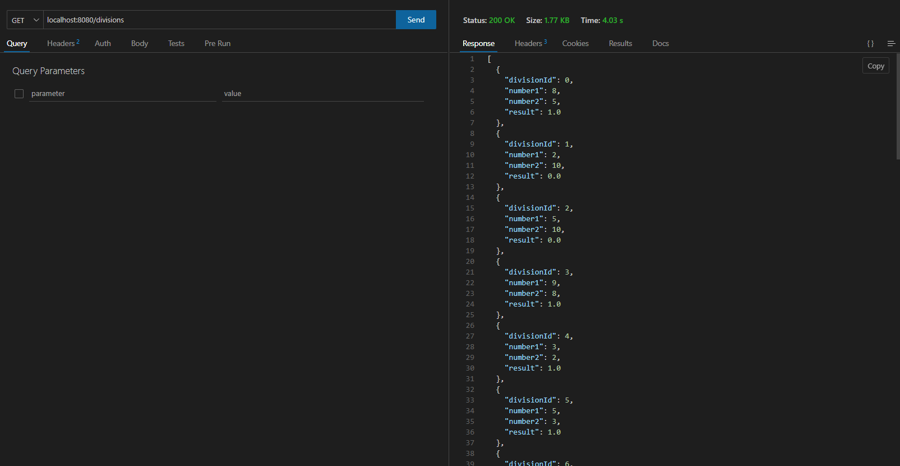

# Microprofile Quarkus
_Romo Valadez Jonathan Joshua_

_Computación tolerante a fallas_

_Universidad de Guadalajara_

_CUCEI_

_Departamento de ciencias computacionales_

---

## Introducción
La tolerancia a fallas muchas veces necesita de varios requerimientos, como tiempo maximo de ejecucion, control de errores, el bloqueo de peticiones durante un periodo de tiempo, entre otras cosas, para esto nos sirve Quarkus, que es una herramienta muy potente para Java.

---

## Desarrollo

### ¿Que es Java EE?
Java Platform, Enterprise Edition (Java EE) se basa en la especificación Java SE. Representa una colaboración entre varios proveedores y líderes del sector y proporciona el soporte de la infraestructura para las aplicaciones.

Java EE es portable y escalable, y soporta la integración existente y los componentes basados en la arquitectura EJB. Java EE simplifica las aplicaciones empresariales definiendo y especificando un complejo conjunto de servicios estándar comunes, como denominación, gestión de transacciones, simultaneidad, seguridad y acceso a base de datos.

### ¿Que es Java SE?
Java Platform, Standard Edition (Java SE) es una especificación que describe una plataforma Java de resumen. Proporciona una base para crear y desplegar aplicaciones de negocio centradas en la red que van desde un ordenador de escritorio PC a un servidor de grupo de trabajo. Java SE lo implementa el kit de desarrollo de software (SDK) Java.

### ¿Que es Jakarta EE?
En 2017 Oracle decide que deja de controlar el desarrollo de Java EE y decide pasarlo a la comundidad para que sea guiado en un proceso más abierto y flexible por la Eclipse Foundation. Manteniendo el modelo de JCP que se seguía en su desarrollo.

Si bien en este proceso de traspaso se decide no pasar la marca Java EE y la comunidad tiene que renombrar el proyecto a Jakarta EE.

### ¿Que es MicroProfile?
Eclipse MicroProfile es una colección de librerías Java EE y tecnologías que juntas forman la línea base para micro-servicios que apunta a entregar aplicaciones portables a través de múltiples sistemas operativos.

La especificación de MicroProfile 1.0 incluye un conjunto de 30 especificaciones adicionales de JEE y estos son: JAX-RS 2.0 para puntos finales de RESTful, CDI 1.1 para las extensiones e inyección de dependencias y JSON-P 1.0 para procesamiento de mensajes JSON.

### ¿Que es Spring boot?
Spring Boot es un framework desarrollado para el trabajo con Java como lenguaje de programación. Se trata de un entorno de desarrollo de código abierto y gratuito.

Facilita el trabajo con otras herramientas como Tomcat, Jetty o Undertow. Lo hace directamente, sin necesidad de implementar archivos específicos para ello.

### ¿Que es Quarkus?
Quarkus es un marco integral de Java diseñado para su implementación en Kubernetes y creado para las compilaciones propias y las máquinas virtuales Java (JVM). Permite optimizar Java especialmente para los contenedores y los entornos sin servidor, de nube y de Kubernetes.

### ¿Que es Maven?
Es una potente herramienta de gestión de proyectos que se utiliza para gestión de dependencias, como herramienta de compilación e incluso como herramienta de documentación. Es de código abierto y gratuita.

### ¿Que es Gradle?
Gradle, es una herramienta que permite la automatización de compilación de código abierto, la cual se encuentra centrada en la flexibilidad y el rendimiento. Los scripts de compilación de Gradle se escriben utilizando Groovy o Kotlin DSL (Domain Specific Language).

### Programa de ejemplo
En este ejemplo se creará una API sencilla que utilizará un modelo de datos sencillo, sirviendo solo para generar datos aleatorios y mostrar los datos guardados hasta el momento.

~~~java
package com.prueba.controller;

import com.prueba.model.Division;
import org.eclipse.microprofile.faulttolerance.*;

import javax.ws.rs.GET;
import javax.ws.rs.POST;
import javax.ws.rs.Path;
import javax.ws.rs.Produces;
import javax.ws.rs.core.MediaType;
import java.util.ArrayList;
import java.util.List;
import java.util.Random;
import java.util.logging.Logger;

@Path("/divisions")
@Produces(MediaType.APPLICATION_JSON)
public class DivisionController {
    List<Division> divisions = new ArrayList<>();
    Long id = 0L;
    Logger LOGGER = Logger.getLogger("Demologger");

    @GET
    @Bulkhead(value = 5)
    @Timeout(value = 5000L)
    @Fallback(fallbackMethod = "getTimeoutFallbackList")
    public List<Division> getDivisionList() {
        LOGGER.info("Ejecutando retorno de divisiones");
        doWait();
        return this.divisions;
    }

    public void doWait() {
        var random = new Random();
        try {
            LOGGER.warning("Haciendo un sleep");
            Thread.sleep((random.nextInt(10) + 2) * 1000L);
        } catch (Exception ex){

        }
    }

    public List<Division> getTimeoutFallbackList(){
        var division = new Division(-2L, -2, -2, -2);
        return List.of(division);
    }

    @POST
    @Retry(maxRetries = 3)
    @Bulkhead(value = 1)
    @CircuitBreaker(failureRatio = 0.1, delay = 15000L)
    @Fallback(fallbackMethod = "getDivisionFallbackList")
    public Division generate() {
        LOGGER.info("Ejecutando generacion de divisiones");
        int number1 = (int)(Math.random()*11);
        int number2 = (int)(Math.random()*11);
        if (number2 == 0) {
            LOGGER.warning("Se produce una falla");
            throw new RuntimeException("Division entre 0");
        } else {
            float result = number1 / number2;
            Division aux = new Division(this.id, number1, number2, result);
            this.id += 1;
            divisions.add(aux);
            return aux;
        }
    }

    public Division getDivisionFallbackList(){
        var division = new Division(-1L, -1, -1, -1);
        return division;
    }

}
~~~

Cuando hacemos una peticion al programa, en caso de que pase el timeout para obtener datos se ira a la funcion fallback que se haya elegido, que en este caso regresa lo siguiente.

Si no excede el timeout se mostrará lo siguiente, que en este caso no hay datos aún.

Ahora se hará un POST para datos, que es menos probable que ocurra un error.

En caso de que ocurra un error se mostrará lo siguiente.

Podemos ver la falla en la consola por medio de un warning.

Por ultimo, esto se mostraría en caso de que haya datos en el programa.

---

## Conclusión
Esta actividad ayudó mucho para aprender nuevas herramientas en otros lenguajes como lo es Java. Esta herramienta es bastante útil, pues maneja bastante bien los errores, permitiendo redireccionar una función en caso de que un error ocurra, o cualquiera de las condiciones como un timeout ocurra.

Por estas razones puede llegar a ser muy útil esta herramienta en caso de que se programe con Java.
